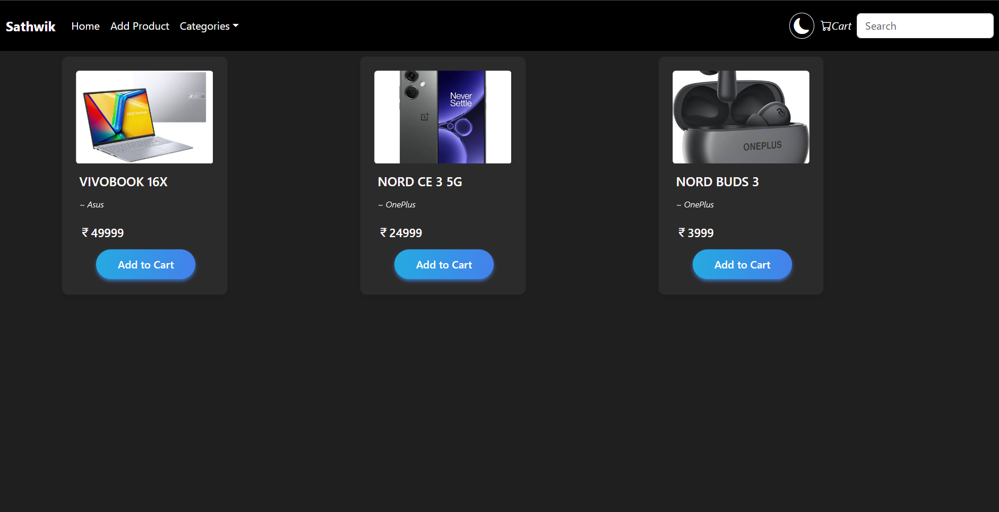
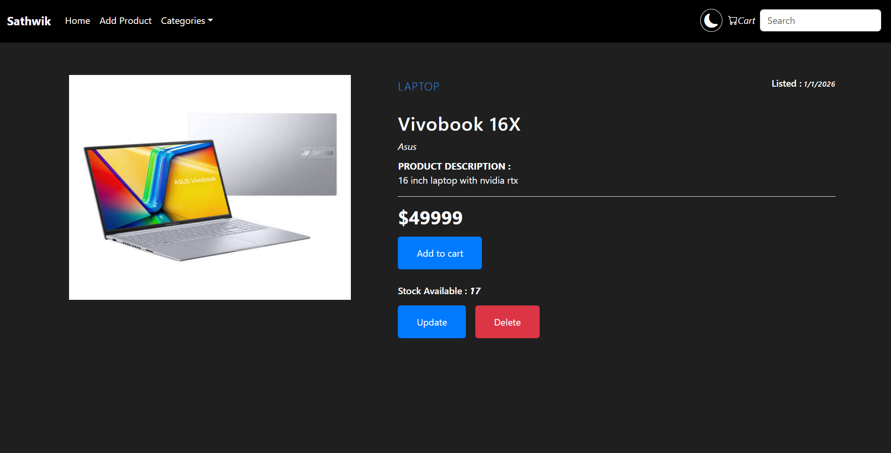
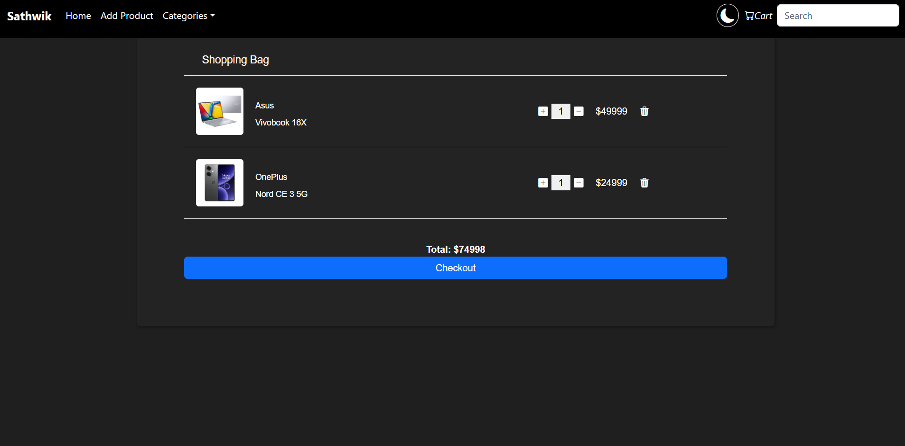
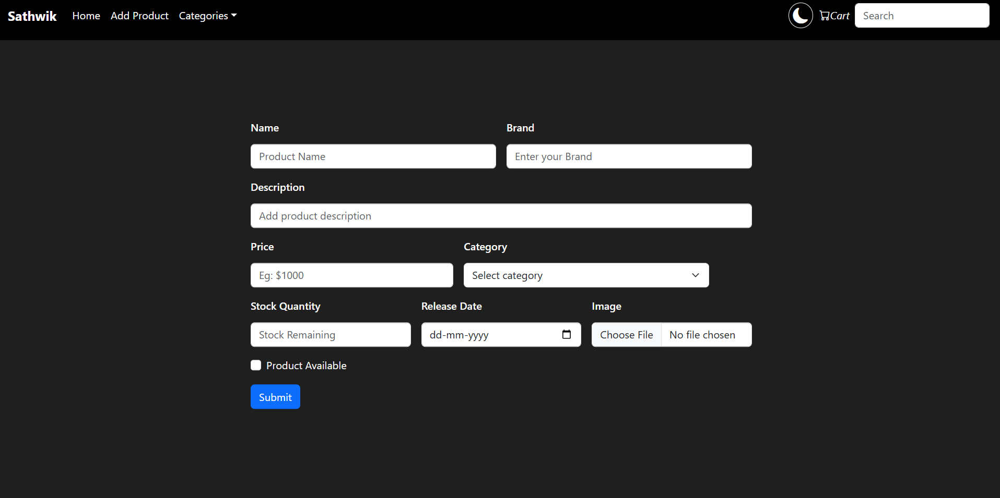
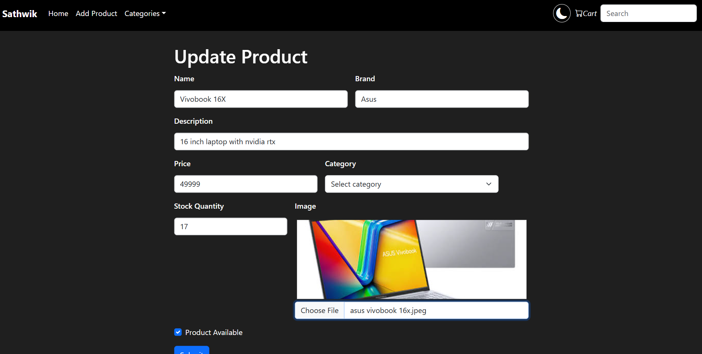
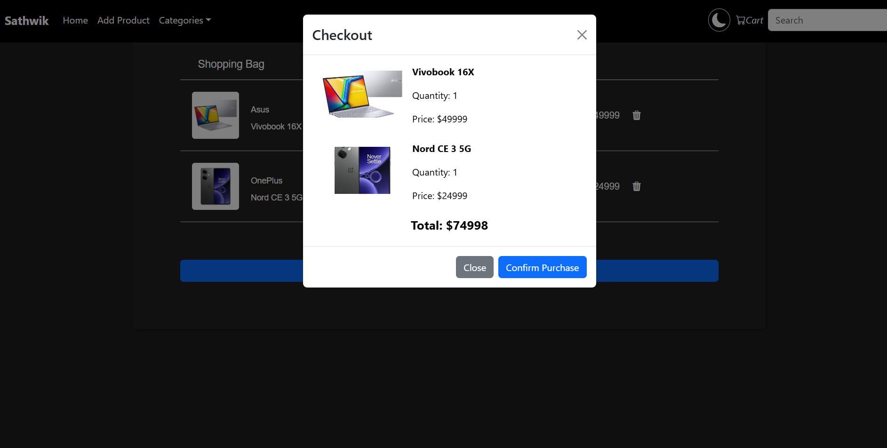
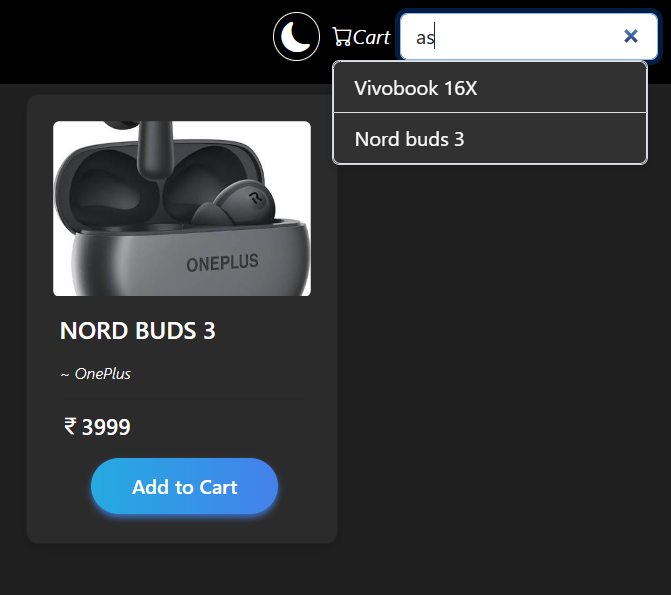

# Ecommerce Project

> A full-stack e-commerce application built with **Spring Boot** (backend) and **React** (frontend) while learning Spring Boot framework.


## 📚 Project Overview

This is a learning project built while exploring **Spring Boot** and **React** technologies. The application demonstrates a basic e-commerce platform with product management, shopping cart functionality, and category-based filtering.

### Key Features
- **Product Management**: Add, update, delete products with images
- **Shopping Cart**: Add items, adjust quantities, checkout
- **Category Filtering**: Filter products by category
- **Product Search**: Search products by name, brand, description, or category
- **Responsive Design**: Works on different screen sizes

---

## 🏗️ Project Structure

```
Ecommerce-Site/
├── ecommerce-springboot-backend/     # Spring Boot REST API
│   ├── src/
│   │   └── main/
│   │       ├── java/com/sathwik/ecom_project/
│   │       │   ├── controller/       # REST Controllers
│   │       │   ├── model/           # JPA Entities
│   │       │   ├── repository/      # Data Access Layer
│   │       │   └── service/         # Business Logic
│   │       └── resources/
│   └── pom.xml                       # Maven dependencies
│
└── ecommerce-react-frontend/         # React Frontend
    ├── src/
    │   ├── components/               # React Components
    │   │   ├── AddProduct.jsx
    │   │   ├── Cart.jsx
    │   │   ├── CheckoutPopup.jsx
    │   │   ├── Home.jsx
    │   │   ├── Navbar.jsx
    │   │   ├── Product.jsx
    │   │   └── UpdateProduct.jsx
    │   ├── Context/                  # React Context (State Management)
    │   ├── assets/
    │   ├── App.jsx                   # Main App Component
    │   └── main.jsx                  # Entry Point
    └── package.json                  # NPM dependencies
```

---

## 🛠️ Technologies Used

### Backend
| Technology | Purpose |
|------------|---------|
| **Spring Boot 4.1.0** | Framework for building REST API |
| **Spring Data JPA** | Database operations with ORM |
| **H2 Database** | In-memory database for development |
| **Lombok** | Reduce boilerplate code |
| **Maven** | Build tool |

### Frontend
| Technology | Purpose |
|------------|---------|
| **React 18** | UI library |
| **Vite** | Build tool & dev server |
| **React Router** | Client-side routing |
| **React Bootstrap** | UI component library |
| **Axios** | HTTP client |
| **Context API** | State management |

---

## 🚀 Getting Started

### Prerequisites
- Java 21 or higher
- Node.js 18+ 
- Maven 3.8+

### Backend Setup

1. Navigate to the backend directory:
```bash
cd ecommerce-springboot-backend
```

2. Build the project:
```bash
./mvnw clean install
```

3. Run the application:
```bash
./mvnw spring-boot:run
```

The backend will start at: **http://localhost:8080**

### Frontend Setup

1. Navigate to the frontend directory:
```bash
cd ecommerce-react-frontend
```

2. Install dependencies:
```bash
npm install
```

3. Start the development server:
```bash
npm run dev
```

The frontend will start at: **http://localhost:5173**

---

## 📡 API Endpoints

### Base URL
```
http://localhost:8080/api
```

| Method | Endpoint | Description |
|--------|----------|-------------|
| GET | `/products` | Get all products |
| GET | `/product/{id}` | Get product by ID |
| POST | `/product` | Add new product |
| PUT | `/product/{id}` | Update product |
| DELETE | `/product/{id}` | Delete product |
| GET | `/product/{id}/image` | Get product image |
| GET | `/products/search?keyword={query}` | Search products |

---

## 💡 Learning Concepts

This project demonstrates the following Spring Boot concepts:

### Backend
- **REST Controllers**: Building RESTful APIs with `@RestController`
- **JPA Entities**: Database modeling with `@Entity`, `@Id`, `@GeneratedValue`
- **Repository Pattern**: Data access with Spring Data JPA's `JpaRepository`
- **Service Layer**: Business logic separation
- **Cross-Origin Requests**: CORS handling with `@CrossOrigin`
- **Multipart File Upload**: Handling image uploads
- **JPQL Queries**: Custom queries with `@Query`

### Frontend
- **React Hooks**: `useState`, `useEffect`, `useContext`
- **Context API**: Global state management for cart
- **React Router**: Client-side navigation
- **Axios**: API communication
- **React Bootstrap**: Styling components

---

## 📝 Product Model

| Field | Type | Description |
|-------|------|-------------|
| id | Integer | Auto-generated ID |
| name | String | Product name |
| description | String | Product description |
| brand | String | Product brand |
| price | BigDecimal | Product price |
| category | String | Product category |
| releaseDate | Date | Release date |
| productAvailable | Boolean | Stock availability |
| stockQuantity | Integer | Available stock |
| imageName | String | Image file name |
| imageType | String | Image MIME type |
| imageData | byte[] | Image binary data |

---

## 🎯 Future Improvements

As this is a learning project, here are features that could be added:

- User authentication and authorization
- Order management system
- Payment integration
- User reviews and ratings
- Order history
- Email notifications
- Product categories management
- Admin dashboard
- MySQL/PostgreSQL database integration
- Docker containerization

---

## 📸 Screenshots

### Home Page



---

### Product Details



---

### Shopping Cart



---

### Add Product



---

### Update Product



---

### Checkout



---

### Search Products



---

## 👨‍💻 Author

Sathwik Reddy - Built with ❤️ while learning Spring Boot.

---

*Last Updated: July 2026*
